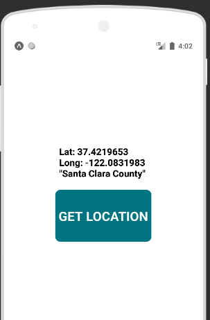

# React Native App for Fetching location data

Here is an example demonstrating how we can track the current location of the device and use that location coordinates to fetch the address details and display it.

Our Final App will look like this:

It shows the current coordinates and the sub-region

PS: If you want to use `reverseGeocodeAsync()` then don't forget to get your Maps API Key from google. Without API key, `reverseGeocodeAsync()` wont work.
